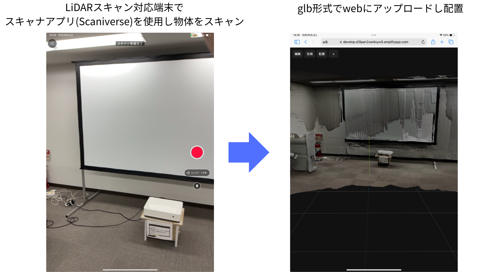

# lidarスキャンした空間データをweb上にthreejsで表示

<!-- プロジェクトのスクリーンショット（画像ファイルを `frontend/public/screenshot.png` に置くと表示されます） -->

## 目的

iPad の LiDAR でスキャンした 3D データ (GLB) を Web 上にアップロード・表示し、以下の拡張機能を備えたアプリを構築する。

基本機能:

- モデル表示
- モデル位置編集機能
- 視点操作 (OrbitControls)
- 計測機能 (2 点間距離)

技術スタック: Vite/React/Three.js/Supabase

